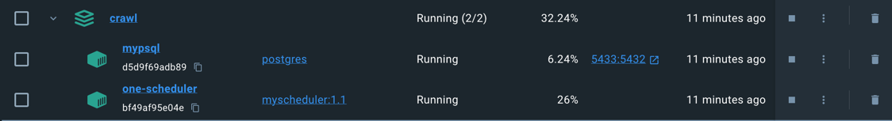
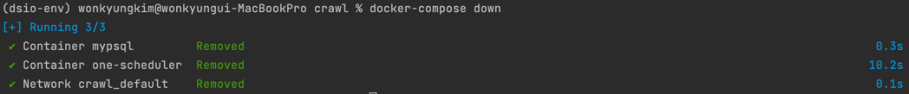
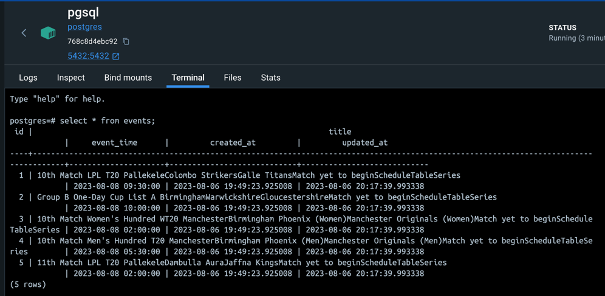
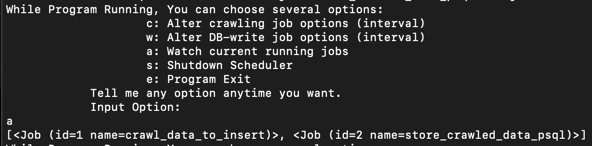
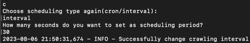
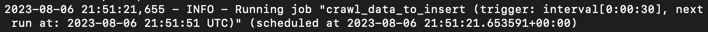
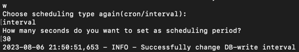
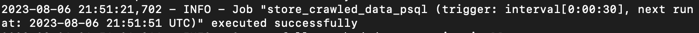
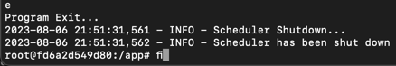

# Web Crawling On Container

## 프로그램 설명
- **개요**: 경기 일정을 초 단위로 크롤링, 데이터베이스 저장, 갱신하는 프로그램

- **Tech Stack**
  * Docker (Dockerfile, docker-compose.yml)
  * Python 3.11
  * PostgreSQL
  * SQLite3
  * APScheduler (python library)
  * BeautifulSoup4 (python library)

- **Strength**
  * 캐시(SQLite3)를 배치해 크롤링 잡과 DB 갱신 작업 간 dependency 제거
  * 프로그램 실행 중에도 CLI 통해 프로그램 동작 변경 가능 (크롤링 및 DB 갱신 주기 각각 변경, 스케줄링된 job 모두 보기, scheduler/program 종료)
  * 캐시, DB 모두 기존 데이터와 title 컬럼 기반 중복 검사. 중복 여부 따라 insert/update 실행 분류
  * 실시간으로 자세한 프로그램 실행 로그 모니터링 가능

- **Weakness**
  * 섬세하지 못하고 단순한 크롤링 (selenium/scrapy 아닌 bs4 사용, 부족한 html 파싱 능력)
  * DB 컬럼 수가 적음. Default options 만 구현
  * docker compose 실행에 의한 백그라운드 스케줄링 프로세스, 컨테이너 접속 후 CLI 기반 user interaction 프로세스 둘로 분리하는데 실패해 모니터링과 사용자 입력을 같은 화면에서 해야 함 
  * test code 부재
  * interval 이 아닌 cron job 설정 시 옵션 변경 미지원, interval을 초 단위로만 지원
  

## 실행 환경
OS 종류 불문 docker 가 설치돼 있으며, 관련 명령을 command 창에서 실행할 수 있어야 함
  

## 실행 방법
#### 1) .zip 파일 다운로드, 압축 해제 후 content root 폴더인 'crawl' 폴더에서 작업.
#### 2) CLI 에 "docker build --tag myscheduler:1.0 ." 입력해 Dockerfile 기반으로 myscheduler:1.0 도커 이미지를 빌드
#### 3) CLI 에 "docker-compose up -d" 입력. 아래 사진은 명령 실행 후 docker desktop UI 캡처본

#### 4) Docker desktop 내 terminal 탭 접속, 또는 로컬 컴퓨터 CLI에 "docker exec -it <container ID or Name> /bin/bash" 입력
#### 5) python main/real_main.py 입력
#### 6) c,w,a,s,e 키 입력을 통해 프로그램과 interaction
#### 앱 전체 종료 및 관련 자원 삭제를 원할 시 "docker-compose down" 명령 입력

  

## 실행 결과
### events table 조회 결과

 

### All Scheduled Jobs 보기

 

### 크롤링 작업 주기 변경
  
기존 기본 옵션 10초에서 30초로 변경된 모습 

 

### DB 갱신 작업 주기 변경
  
기존 기본 옵션 10초에서 30초로 변경된 모습 

 

### 프로그램 종료
